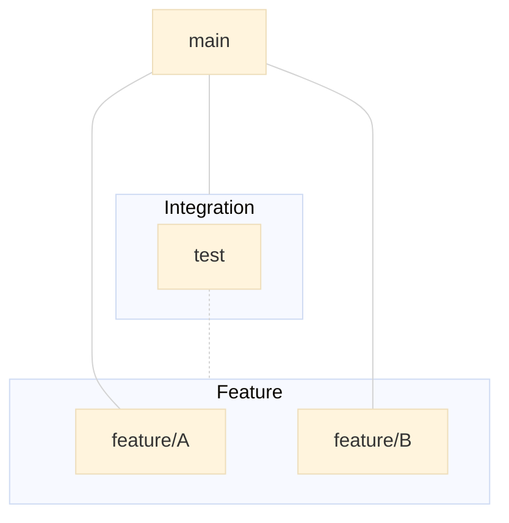
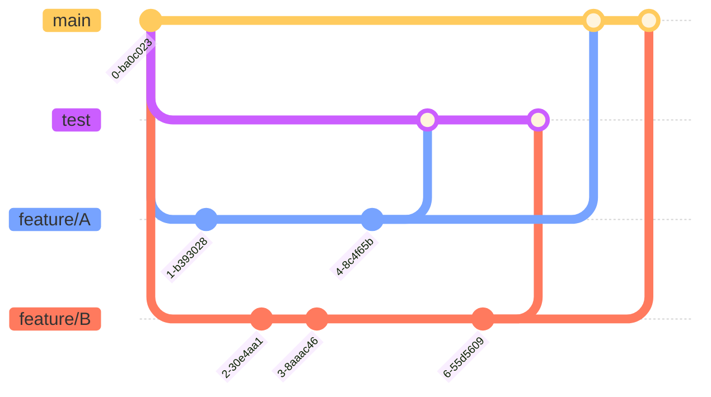

# git 브랜치 전략

## git flow
  

## github flow
  

<!--
## git flow vs github flow
## 두 전략을 같이 사용할 수 있는 방법?

-->

## 읽을거리  
- [A successful Git branching model](https://nvie.com/posts/a-successful-git-branching-model/)
- [우린 Git-flow를 사용하고 있어요](https://techblog.woowahan.com/2553/)
