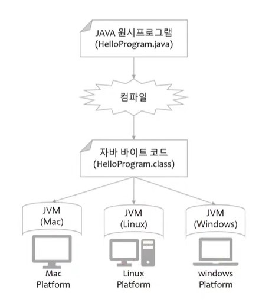

# 기본문법, 제어문, 배열

## java 기본
- 운영체제(Operating System, OS)
  시스템 하드웨어를 관리할 뿐 아니라 응용 소프트웨어를 실행하기 위하여 하드웨어 추상화 플랫폼과 공통 시스템 서비스를 제공하는 시스템 소프트웨어
  (장치 관리자 참고)

  

- 프로그램(Program)
  컴퓨터에서 실행될 때 특정 작업(specific task)을 수행하는 일련의 명령어들의 모음

  

- JVM
  자바 바이트 코드를 실행할 수 있는 주체
  자바 바이트코드는 플랫폼에 **독립적**이며(자바의 특이한 점)
  모든 자바 가상 머신은 자바 가상 머신 규격에 정의된 대로 자바 바이트코드를 실행
  
  

- 비트(Bit)
- 바이트(Byte) - 8비트
- 2진수(Binary)
- 2의 보수
  반전 후 +1
  010(2) => 101 => 110(-2)

## 변수와 타입

## 연산자

## 제어문
