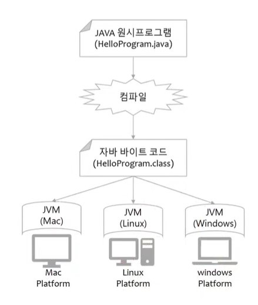

# 기본문법, 제어문, 배열

## java 기본
- 운영체제(Operating System, OS)
  시스템 하드웨어를 관리할 뿐 아니라 응용 소프트웨어를 실행하기 위하여 하드웨어 추상화 플랫폼과 공통 시스템 서비스를 제공하는 시스템 소프트웨어
  (장치 관리자 참고)


- 프로그램(Program)
  컴퓨터에서 실행될 때 특정 작업(specific task)을 수행하는 일련의 명령어들의 모음
  
  
  
- JVM
  자바 바이트 코드를 실행할 수 있는 주체
  자바 바이트코드는 플랫폼에 **독립적**이며(자바의 특이한 점)
  모든 자바 가상 머신은 자바 가상 머신 규격에 정의된 대로 자바 바이트코드를 실행
  
  




- 컴퓨터의 자료표현
  - 비트(Bit)
  - 바이트(Byte) - 8비트
  - 2진수(Binary)
  - 2의 보수
    반전 후 +1
    010(2) => 101 => 110(-2)


- 메인 메소드

  실행 명령인 java를 실행 시 가장 먼저 호출되는 부분
  만약, Application에서 main() 메소드가 없다면 절대로 실행될 수 없음
  Application의 시작 = 특정 클래스의 main() 실행
  
  형태
  ```java
  public static void main(String [] args) {}
  ```


- 출력문
  - print
  - println
  - printf
    - %d: 정수
    - %f: 실수
    - %c: 문자
    - %s: 문자열


## 변수와 타입
- 변수
  - 선언
  - 초기화  

  '$'와 '_'만 변수이름에 사용가능


- 자료형
	- 기본 자료형 
    char: 0 ~ 65535
    byte: 0 ~ 127
    short: -32768 ~ 32767
  
  
  
  - 참조 자료형


- 형변환

  - 자료형의 크기 비교

    ```
    byte < short < int < long < float < double
           char  < int < long < float < double
    ```
    
  - 데이터 형변환
  
    - 묵시적
      범위가 넓은 데이터 형에 좁은 데이터 형을 대입하는 것
    - 명시적
      범위가 좁은 데이터 형에 넓은 데이터 형을 대입하는 것
      ex) `int i = 100; byte b = i; (X)`, `byte b = (byte) i; (O)`


## 연산자
- 3항 연산자
  
  ```
	조건식 ? 수식1 : 수식2;
	```


- 산술 연산자
  - `+ - *`
  - `/`: 몫
  - `%`: 나머지


- 증감 연산자
  - `++`: a++/ ++a
  - `--`: a--/ --a

- 비교 연산자
- 조건 연산자
- 배정 연산자


## 제어문(조건문)
- if문
	- 단일 if
	- 다중 if
	- 내포된 if
- switch문


## 제어문(반복문)
- for
- while
- do ~ while
- break
- continue


## 배열