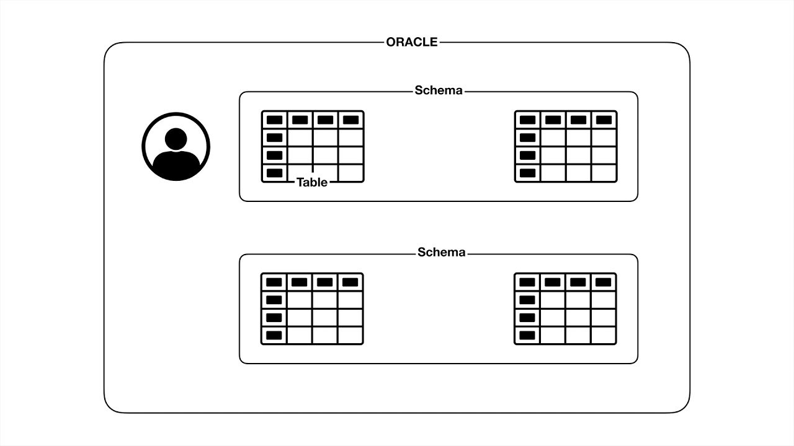
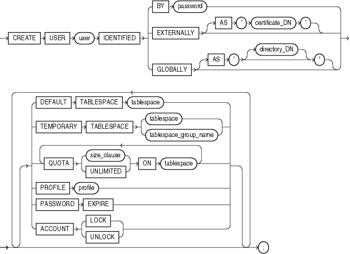

# 오라클

https://opentutorials.org/course/3885

## SQL
> Structured Query Language


## 설치

현재 버전: Oracle Database 21c Express Edition


## 사용자와 스키마

> 스키마에 속하는 표들을 정의하는 게 스키마

혼자서 쓰려고 오라클을 쓰는 경우는 없음
많은 사용자가 오라클 데이터베이스가 속한 컴퓨터에 네트워크를 통해 접속하게 됨

=> 여러 사용자를 만들 수 있고 각각의 사용자는 자신이 관리하는 테이블에 접속할 수 있음
=> 사용자를 만들면 사용자에 속하는 스키마를 만들게 됨




### 사용자 생성과 권한 부여

```sql
sys AS SYSDBA (database system administrator)
-- ALTER SESSION SET "_ORACLE_SCRIPT" = TRUE;

CREATE USER chshin IDENTIFIED BY 111111;
-- 아직 아무런 권한이 부여되지 않은 상태

GRANT DBA TO chshin;
-- 현실에서 권한은 보수적으로 부여해야 함
```



## 테이블

### 테이블 생성
> CREATE TABLE table (
> 	column 데이터타입 조건,
> 	...
> );
- 데이터 타입
  - 
- 제약조건
  - 
```sql
CREATE TABLE topic(
	id NUMBER NOT NULL,
    title VARCHAR2(50) NOT NULL,
    description VARCHAR2(4000),
    created DATE NOT NULL,
	CONSTRAINT PK_TOPIC PRIMARY KEY (id)
);
SELECT table_name FROM user_tables;
```
```
TABLE_NAME
--------------------------------------------------------------------------------
TOPIC
```


## 행
### 행 추가(C)
> INSERT INTO table
> 	(field1, field2, ...)
> 	VALUES (
> 		value1,
> 		value2,
> 		...
> 	);

```sql
INSERT INTO topic
	(id, title, description, created)
	VALUES
	(1, 'ORACLE', 'ORACLE is ...', SYSDATE);

INSERT INTO topic
	(id, title, description, created)
	VALUES
	(2, 'MySQL', 'MySQL is ...', SYSDATE);

INSERT INTO topic
	(id, title, description, created)
	VALUES
	(3, 'SQL Server', 'SQL Server is ...', SYSDATE);

commit;
```


### 행 읽기(R)
```sql
SELECT * FROM table;

SELECT id, title, created FROM topic;

SELECT * FROM topic WHERE id = 1;
SELECT * FROM topic WHERE id > 1;

SELECT id, title, created FROM topic WHERE id = 1;

SELECT * FROM topic ORDER BY id DESC;
SELECT * FROM topic ORDER BY title ASC;

SELECT * FROM topic OFFSET 1 ROWS;
SELECT * FROM topic OFFSET 1 ROWS FETCH NEXT 1 ROWS ONLY;
```


### 행 수정(U)
```sql
UPDATE topic
	SET
		title='MSSQL',
		description = 'MSSQL is ...'
	WHERE
		id = 3;
commit;
```


### 행 삭제(D)
```sql
DELETE FROM topic WHERE id = 3;
commit;
```


## PRIMARY KEY
